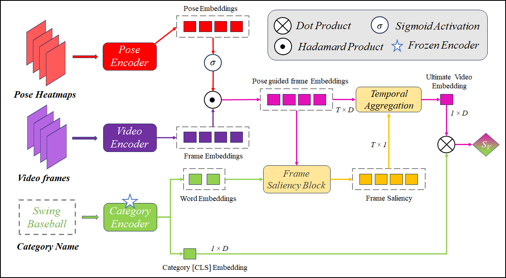

<div align="center">

<h2>【ICVGIP'2023】ViLP: Knowledge Exploration using Vision, Language and Pose Embeddings for Video Action Recognition </h2>

[-2023-brightgreen.svg
)](https://dl.acm.org/doi/abs/10.1145/3627631.3627637) 
[](https://arxiv.org/abs/2308.03908)


This is the official implementation of **ViLP** (ICVGIP'23 Oral) , which leverages cross-modal bridge to enhance video recognition by exploring tri-directional knowledge.
</div>

## Overview
**ViLP** explores cross-modal knowledge from the pre-trained vision-language model (e.g., CLIP) to introduce the combination of pose, visual information, and text attributes which has not been explored yet.




## Content
- [Prerequisites](#prerequisites)
- [Data Preparation](#data-preparation)
- [Training](#training)  
- [Testing](#testing)  
- [BibTeX & Citation](#bibtex)
- [Acknowledgment](#acknowledgment)

<a name="prerequisites"></a>
## Prerequisites

<details><summary>The code is built with following libraries. </summary><p>

- [PyTorch](https://pytorch.org/) >= 1.8
- RandAugment
- pprint
- tqdm
- dotmap
- yaml
- csv
- Optional: decord (for on-the-fly video training)
- Optional: torchnet 
</p></details>


<a name="data-preparation"></a>
## Data Preparation


### Video Loader

**(Recommend)** To train all of our models, we extract videos into frames for fast reading. Please refer to [MVFNet](https://github.com/whwu95/MVFNet/blob/main/data_process/DATASETS.md) repo for the detailed guide of dataset processing.  
The annotation file is a text file with multiple lines, and each line indicates the directory to frames of a video, total frames of the video and the label of a video, which are split with a whitespace. 
<details open><summary>Example of annotation</summary>

```sh
abseiling/-7kbO0v4hag_000107_000117 300 0
abseiling/-bwYZwnwb8E_000013_000023 300 0
```
</details>

(Optional) We can also decode the videos in an online fashion using [decord](https://github.com/dmlc/decord). This manner should work but are not tested. All of the models offered have been trained using offline frames. 
<details><summary>Example of annotation</summary>

```sh
  abseiling/-7kbO0v4hag_000107_000117.mp4 0
  abseiling/-bwYZwnwb8E_000013_000023.mp4 0
```
</details>


### Annotation
Annotation information consists of two parts: video label, and category description.

- Video Label: As mentioned above, this part is same as the traditional video recognition. Please refer to [lists/ucf101/train_rgb_split_1.txt](https://github.com/whwu95/BIKE/blob/main/lists/ucf101/train_rgb_split_1.txt) for the format.
- Category Description: We also need a textual description for each video category.  Please refer to [lists/ucf101/ucf_labels.csv](https://github.com/whwu95/BIKE/blob/main/lists/ucf101/ucf_labels.csv) for the format.

### Heatmap Preparation
We have followed and cloned this repo of [Openpose](https://github.com/gsethi2409/tf-pose-estimation) for generating heatmaps of the corresponding frames. Our implementation is outlined here: [img_to_heatmap](img_to_heatmap.ipynb). 

<a name="training"></a>
## 🚀 Training

1. **Single GPU**: To train our model with 1 GPU in *Single Machine*, you can run:
```sh
sh scripts/run_train.sh  configs/ucf101/ucf_ViLP.yaml
# For performing ablation studies, replace the train.py file with train_pose_text.py/train_withut_text.py etc in scripts/run_train.sh as per requirement.
```

<a name="testing"></a>
## ⚡ Testing
We support single-view validation (default) and multi-view (4x3 views) validation.

```sh
# The testing command for obtaining top-1/top-5 accuracy.
sh scripts/run_test.sh Your-Config.yaml Your-Trained-Model.pt

```


<a name="bibtex"></a>
## 📌 BibTeX & Citation

If you use our code in your research or wish to refer to the baseline results, please use the following BibTeX entry😁.


```bibtex
@inproceedings{chaudhuri2023vilp,
  title={Vilp: Knowledge exploration using vision, language, and pose embeddings for video action recognition},
  author={Chaudhuri, Soumyabrata and Bhattacharya, Saumik},
  booktitle={Proceedings of the Fourteenth Indian Conference on Computer Vision, Graphics and Image Processing},
  pages={1--7},
  year={2023}
}
```


<a name="acknowledgment"></a>
## 🎗️ Acknowledgement

This repository is built based on [BIKE](https://github.com/whwu95/BIKE) and [Text4Vis](https://github.com/whwu95/Text4Vis). Sincere thanks to their wonderful works.


## 👫 Contact
For any question, please file an issue.

