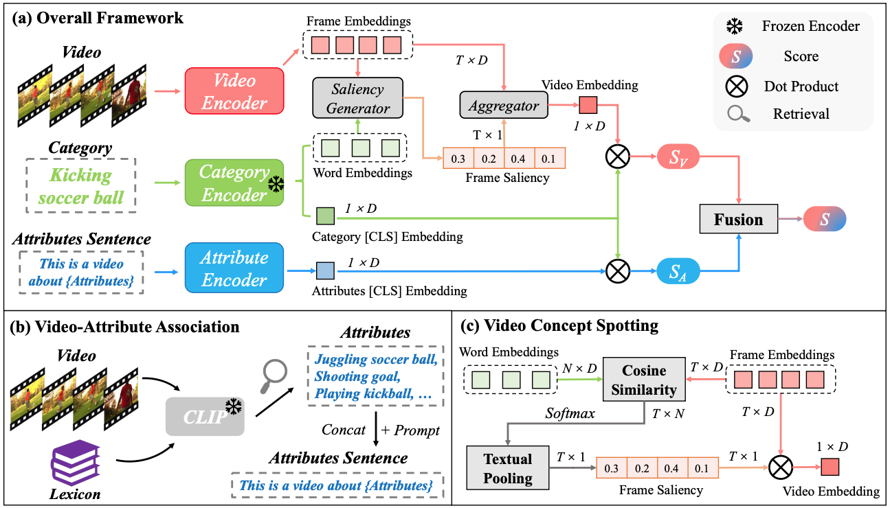

<div align="center">

<h2>【ICVGIP'2023】ViLP: Knowledge Exploration using Vision, Language and Pose Embeddings for Video Action Recognition </h2>

[](https://dl.acm.org/doi/abs/10.1145/3627631.3627637) 
[](https://arxiv.org/abs/2308.03908)


This is the official implementation of our **ViLP**, which leverages cross-modal bridge to enhance video recognition by exploring tri-directional knowledge.
</div>

## Overview
🚴**BIKE** explores bidirectional cross-modal knowledge from the pre-trained vision-language model (e.g., CLIP) to introduce auxiliary attributes and category-dependent temporal saliency for improved video recognition.




## Content
- [Prerequisites](#prerequisites)
- [Data Preparation](#data-preparation)
- [Model Zoo](#model-zoo)
- [Training](#training)  
- [Testing](#testing)  
- [BibTeX & Citation](#bibtex)
- [Acknowledgment](#acknowledgment)

<a name="prerequisites"></a>
## Prerequisites

<details><summary>The code is built with following libraries. </summary><p>

- [PyTorch](https://pytorch.org/) >= 1.8
- RandAugment
- pprint
- tqdm
- dotmap
- yaml
- csv
- Optional: decord (for on-the-fly video training)
- Optional: torchnet (for mAP evaluation on ActivityNet)
</p></details>


<a name="data-preparation"></a>
## Data Preparation


### Video Loader

**(Recommend)** To train all of our models, we extract videos into frames for fast reading. Please refer to [MVFNet](https://github.com/whwu95/MVFNet/blob/main/data_process/DATASETS.md) repo for the detailed guide of dataset processing.  
The annotation file is a text file with multiple lines, and each line indicates the directory to frames of a video, total frames of the video and the label of a video, which are split with a whitespace. 
<details open><summary>Example of annotation</summary>

```sh
abseiling/-7kbO0v4hag_000107_000117 300 0
abseiling/-bwYZwnwb8E_000013_000023 300 0
```
</details>

(Optional) We can also decode the videos in an online fashion using [decord](https://github.com/dmlc/decord). This manner should work but are not tested. All of the models offered have been trained using offline frames. 
<details><summary>Example of annotation</summary>

```sh
  abseiling/-7kbO0v4hag_000107_000117.mp4 0
  abseiling/-bwYZwnwb8E_000013_000023.mp4 0
```
</details>


### Annotation
Annotation information consists of two parts: video label, and category description.

- Video Label: As mentioned above, this part is same as the traditional video recognition. Please refer to [lists/k400/kinetics_rgb_train_se320.txt](lists/k400/kinetics_rgb_train_se320.txt) for the format.
- Category Description: We also need a textual description for each video category.  Please refer to [lists/k400/kinetics_400_labels.csv](lists/k400/kinetics_400_labels.csv) for the format.

<a name="training"></a>
## 🚀 Training
This implementation supports Multi-GPU `DistributedDataParallel` training, which is faster and simpler than `DataParallel` training. 
*Note: The JSON file containing the attributes is already available at https://github.com/whwu95/BIKE/releases/tag/v1.0.*

1. **Single Machine**: To train our model on Kinetics-400 with 8 GPUs in *Single Machine*, you can run:
```sh
# We train the 8 Frames ViT-B/32 video model (i.e., video branch).
sh scripts/run_train.sh  configs/k400/k400_train_rgb_vitb-32-f8.yaml

# We train the video branch and attributes branch.
sh scripts/run_co_train.sh  configs/k400/k400_train_video_attr_vitb-32-f8.yaml
```

<details><summary>2. Mulitple Machines: We also provide the script to train larger model with Mulitple Machines (e.g., 2 nodes have 16 GPUs).</summary>

```sh
# For example, we train the 8 Frames ViT-L/14-336 with 2 machines as follows:
# For first machine, you need to set the ip of your first machine as the --master_addr, --nnodes is 2.
# Compared with the Single-Machine training script, only one node_id needs to be added.
sh scripts/run_train_multinodes.sh configs/k400/configs/k400/k400_train_rgb_vitl-14-336-f8.yaml 0

# For second machine, --master_addr is still the ip of your first machine
sh scripts/run_train_multinodes.sh configs/k400/configs/k400/k400_train_rgb_vitl-14-336-f8.yaml 1
```
</details>


<details><summary>3. Few-shot Recognition: To train our model under Few-shot scenario, you just need to add one line in the general config file.</summary>

```sh
# You can refer to config/k400/k400_few_shot.yaml
data: 
    ...  # general configurations
    shot: 2  # i.e., 2-shot setting
```
</details>

<a name="testing"></a>
## ⚡ Testing
We support single-view validation (default) and multi-view (4x3 views) validation.

```sh
# The testing command for obtaining top-1/top-5 accuracy.
sh scripts/run_test.sh Your-Config.yaml Your-Trained-Model.pt

# The command for zero-shot evaluation is similar.
sh scripts/run_test_zeroshot.sh Your-Config.yaml Your-Trained-Model.pt
```

We provide more examples of testing commands below.


<details open><summary>General / Few-shot Video Recognition</summary>

```sh
# Efficient Setting: Single view evaluation. 
# E.g., ViT-L/14 8 Frames on Kinetics-400. You should get around 86.5% top-1 accuracy. 
sh scripts/run_test.sh  configs/k400/k400_train_rgb_vitl-14-f8.yaml exps/k400/ViT-L/14/8f/k400-vit-l-14-f8.pt

# Accurate Setting: Multi-view evalition (4clipsx3crops).
# You should get around 87.4% top-1 accuracy. 
sh scripts/run_test.sh  configs/k400/k400_train_rgb_vitl-14-f8.yaml exps/k400/ViT-L/14/8f/k400-vit-l-14-f8.pt --test_crops 3  --test_clips 4

# Test the Charades dataset using the mAP metric. You should achieve around 50.7 mAP.
sh scripts/run_test_charades.sh configs/charades/charades_k400_finetune_336.yaml exps/charades/ViT-L/14-336px/16f/charades-vit-l-336-f16.pt --test_crops 1  --test_clips 4

# Test the ActivityNet dataset using top1 and mAP metric. You should achieve around 96.3 mAP.
sh scripts/run_test.sh configs/anet/anet_k400_finetune.yaml exps/anet/ViT-L/14/f16/anet-vit-l-f16.pt --test_crops 1  --test_clips 4
```
</details>


<details><summary>Zero-shot Evaluation<p></summary>


We use the Kinetics-400 pre-trained model (e.g., [ViT-L/14 with 8 frames](configs/k400/k400_train_rgb_vitl-14-f8.yaml)) to perform cross-dataset zero-shot evaluation, i.e., UCF101, HMDB51, ActivityNet, Kinetics-600.


- Half-classes Evaluation: A traditional evaluation protocol involves selecting half of the test dataset's classes, repeating the process ten times, and reporting the mean accuracy with a standard deviation of ten times.


- Full-classes Evaluation: Perform evaluation on the entire dataset.

```sh
# On ActivityNet: reporting the half-classes and full-classes results
# Half-classes: 86.18 ± 1.05, Full-classes: 80.04
sh scripts/run_test_zeroshot.sh  configs/anet/anet_zero_shot.yaml exps/k400/ViT-L/14/8f/k400-vit-l-14-f8.pt

# On UCF101: reporting the half-classes and full-classes results
# Half-classes: 86.63 ± 3.4, Full-classes: 80.83
sh scripts/run_test_zeroshot.sh  configs/ucf101/ucf_zero_shot.yaml exps/k400/ViT-L/14/8f/k400-vit-l-14-f8.pt

# On HMDB51: reporting the half-classes and full-classes results
# Half-classes: 61.37 ± 3.68, Full-classes: 52.75
sh scripts/run_test_zeroshot.sh  configs/hmdb51/hmdb_zero_shot.yaml exps/k400/ViT-L/14/8f/k400-vit-l-14-f8.pt

# On Kinetics-600: manually calculating the mean accuracy with standard deviation of three splits.
# Split1: 70.14, Split2: 68.31, Split3: 67.15
# Average: 68.53 ± 1.23
sh scripts/run_test.sh  configs/k600/k600_zero_shot_split1.yaml exps/k400/ViT-L/14/8f/k400-vit-l-14-f8.pt
sh scripts/run_test.sh  configs/k600/k600_zero_shot_split2.yaml exps/k400/ViT-L/14/8f/k400-vit-l-14-f8.pt
sh scripts/run_test.sh  configs/k600/k600_zero_shot_split3.yaml exps/k400/ViT-L/14/8f/k400-vit-l-14-f8.pt
```
</details>

<a name="bibtex"></a>
## 📌 BibTeX & Citation

If you use our code in your research or wish to refer to the baseline results, please use the following BibTeX entry😁.


```bibtex
@inproceedings{bike,
  title={Bidirectional Cross-Modal Knowledge Exploration for Video Recognition with Pre-trained Vision-Language Models},
  author={Wu, Wenhao and Wang, Xiaohan and Luo, Haipeng and Wang, Jingdong and Yang, Yi and Ouyang, Wanli},
  booktitle={Proceedings of the IEEE/CVF Conference on Computer Vision and Pattern Recognition (CVPR)},
  year={2023}
}
```

If you also find [Text4Vis](https://github.com/whwu95/Text4Vis) useful 😁, please cite the paper:

```bibtex
@article{text4vis,
  title={Revisiting Classifier: Transferring Vision-Language Models for Video Recognition},
  author={Wu, Wenhao and Sun, Zhun and Ouyang, Wanli},
  booktitle={Proceedings of AAAI Conference on Artificial Intelligence (AAAI)},
  year={2023}
}
```

<a name="acknowledgment"></a>
## 🎗️ Acknowledgement

This repository is built based on [Text4Vis](https://github.com/whwu95/Text4Vis), [ActionCLIP](https://github.com/sallymmx/actionclip), and [CLIP](https://github.com/openai/CLIP). Sincere thanks to their wonderful works.


## 👫 Contact
For any question, please file an issue.

